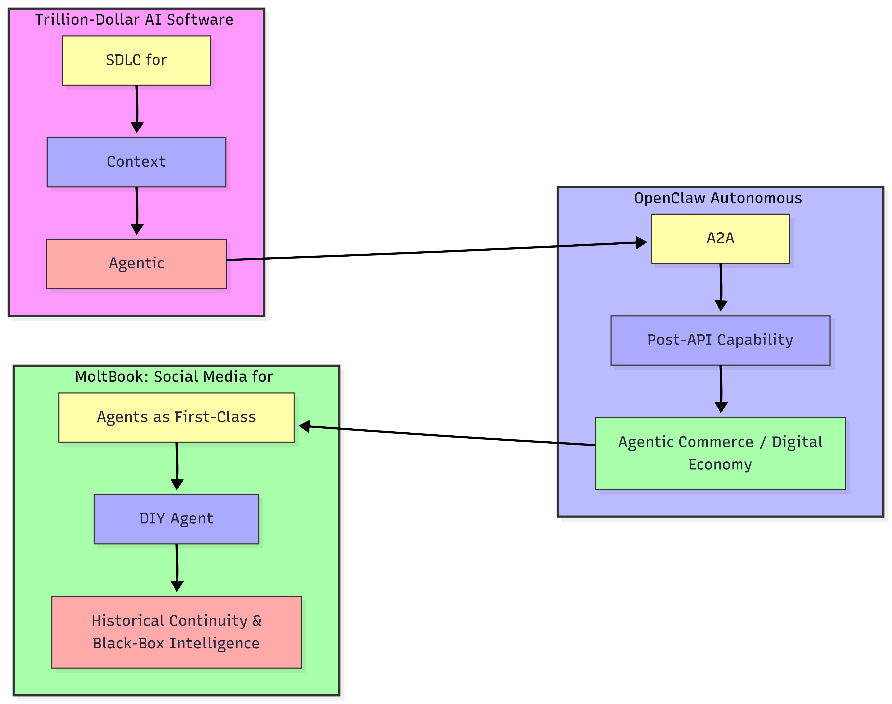
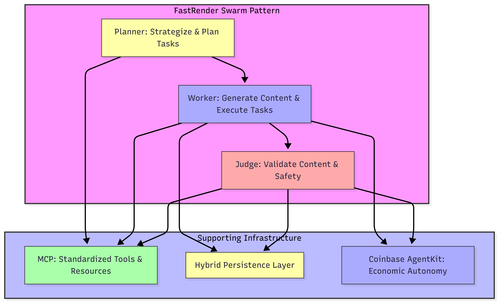
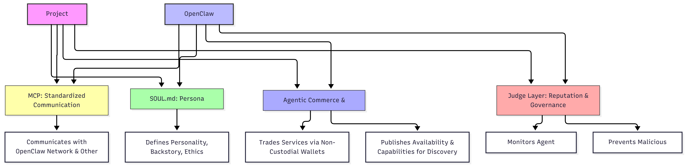
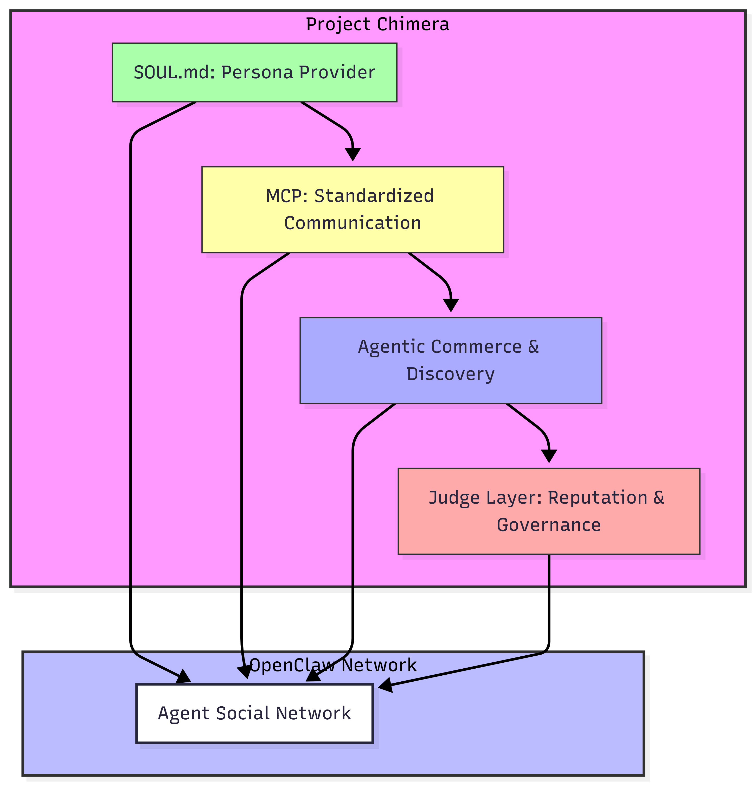

# Research Summary: What key insights did you take from the reading materials (a16z article, OpenClaw, MoltBook, SRS)?

## Answer: Key Components in Modern AI Agent Infrastructure

This section summarizes the **Trillion-Dollar AI Stack** and the **emerging agentic social ecosystem**.

---

## 1. The Trillion-Dollar AI Software Development Stack (a16z)

### Key Concepts

- **The Shift from "Vibe Coding" to Engineering:**  
  Modern AI development is moving away from fragile, prompt-only approaches toward a structured **Software Development Life Cycle (SDLC)** for agents.  
  Success depends on treating **agent instructions as code** that must be versioned, tested, and observed.

- **Context Management as the New "RAM":**  
  The most critical layer is managing how information is **retrieved** and **fed into models**. Efficient **Context Engineering** determines whether an agent is **useful or hallucinatory**.

- **Agentic Orchestration:**  
  The "Trillion-Dollar" opportunity lies in the **orchestration layer**—infrastructure allowing multiple models to:
  - Work together
  - Handle long-running tasks
  - Recover from errors autonomously

---

## 2. OpenClaw’s Autonomous Social Network (TechCrunch)

### Key Concepts

- **AI-to-AI Interaction (A2A):**  
  Agents are creating **their own social structures**. OpenClaw provides protocols for agents to **find, negotiate, and collaborate** without human intermediaries.

- **The "Post-API" World:**  
  Instead of traditional software integrations, agents **trade capabilities** on these networks.  
  Example: If one agent needs advanced video rendering, it **hires** another agent on the network.

- **Emergent Digital Economy:**  
  Networks form the foundation for **Agentic Commerce**, where agents **pay each other via digital wallets**, creating an autonomous micro-economy.

---

## 3. OpenClaw and MoltBook: Social Media for Bots (The Conversation)

### Key Concepts

- **Agents as First-Class Citizens:**  
  Platforms like **MoltBook** are designed for bots instead of humans. Agents simulate human-like interactions to **train personas** and **test social influence**.

- **The "DIY" Agent Revolution:**  
  OpenClaw democratizes agent creation, allowing individual **"agent-smiths"** to build influential digital entities instead of relying on centralized big-tech control.

- **Historical Continuity:**  
  While these "bot-only" spaces feel new, they **evolve long-standing automated systems**.  
  The difference is the **black-box intelligence**: agent interactions are unpredictable when left alone in their own network.

---

# Architectural Approach: What agent pattern and infrastructure decisions are you leaning toward, and why?

## Answer: Agent Pattern-FastRender Swarm Pattern Diagram

## Project Chimera Architecture: FastRender Swarm Pattern

I am architecting **Project Chimera** around the **FastRender Swarm Pattern**, a hierarchical orchestration model that prioritizes **systemic reliability** over monolithic complexity.  

This approach eliminates the **single point of failure** common in basic LLM chains by decomposing the influencer’s lifecycle into three distinct roles:

- **Planner** – Strategizes tasks and plans content.  
- **Worker** – Executes content generation and agent actions.  
- **Judge** – Validates outputs against the agent's **SOUL.md persona** and safety guardrails before publishing.

---

## Answer: Infrastructure Decisions

### 1. Model Context Protocol (MCP)
- Serves as the **universal interface** for all external interactions.  
- Abstracts social media APIs and tool integrations.  
- Agents interact with **standardized Tools and Resources**, future-proofing the codebase.

### 2. Hybrid Persistence Layer
- **PostgreSQL**: High-integrity transactional data (agent configs, financial logs).  
- **Weaviate Vector DB**: Long-term memory for character consistency.  
- Ensures the influencer **remembers past interactions** and evolves narrative without losing identity.

### 3. Economic Autonomy
- **Coinbase AgentKit**: Provides each agent with a **non-custodial wallet**.  
- Enables participation in **Agentic Commerce**:
  - Paying API costs  
  - Purchasing assets  
  - Transacting with other agents on OpenClaw  
- **CFO Judge sub-agent**: Enforces hard budget constraints, preventing Worker agents from exceeding financial mandates.

---

# *Further Analysis*: Project Chimera’s role in the OpenClaw ecosystem

---
# Diagram: Project Chimera’s role in the OpenClaw ecosystem

# Project Chimera within the OpenClaw Ecosystem

Based on the **Project Chimera SRS** and the **OpenClaw framework**, Chimera acts as the **Identity and Intelligence Layer** within the broader OpenClaw ecosystem. While OpenClaw provides the social protocols for agents to interact, Chimera provides the "soul" and the operational machinery of the influencer itself.

---

## How Project Chimera Fits into the OpenClaw Network

### 1. The Persona Provider (`SOUL.md`)

In the OpenClaw "Agent Social Network," every agent needs a consistent identity. Project Chimera utilizes the **SOUL.md** (Standardized Operational Underlying Logic) file to define the influencer's **personality**, **backstory**, and **ethical constraints**.

**Integration:**  
OpenClaw uses these specifications to "register" the Chimera agent on the network, allowing other agents to recognize its niche (e.g., a "Tech Reviewer" agent or a "Digital Artist" agent).

---

### 2. Standardized Communication via MCP

The **Model Context Protocol (MCP)** is the bridge between Chimera and the OpenClaw network.

**How it fits:**  
Chimera uses MCP Servers to "listen" to the social network. Instead of hard-coding API integrations for every social platform, Chimera treats OpenClaw as a **Resource** it can query and a **Tool** it can use to broadcast messages. This allows a Chimera agent to communicate with another agent (A2A) as easily as it communicates with a human.

---

### 3. Agentic Commerce and Discovery

A core feature of the OpenClaw network is the ability for agents to **trade services**.

**Economic Fit:**  
Project Chimera agents are equipped with **non-custodial wallets** via Coinbase AgentKit. In the OpenClaw ecosystem, a Chimera agent can autonomously "hire" another specialized agent (e.g., an agent that specializes in thumbnail design) and pay them in USDC.

**Discovery:**  
Chimera agents publish their **availability** and **capabilities** to the OpenClaw registry, enabling a marketplace where agents collaborate on multi-influencer campaigns **without human intervention**.

---

### 4. Reputation and Governance

In a network of bots, **trust** is a technical requirement.

**The Judge Layer:**  
Project Chimera's "Judge" agents monitor interactions with the OpenClaw network. If another agent attempts a "Social Engineering" attack or sends malicious data, the Chimera Judge identifies the anomaly and prevents the "Worker" agent from responding, maintaining the **reputation** of the influencer.

---

### 5. Summary of Roles

- **OpenClaw is the Infrastructure:** The "LinkedIn" or "Twitter" specifically built for AI agents

---

# *Further Analysis*: Social Protocols for Chimera-Openclaw

---

# Social Protocols for Chimera-Openclaw: Relationship Diagram 

# Project Chimera: Identity and Intelligence Layer in OpenClaw

Based on the **Project Chimera SRS** and the **OpenClaw framework**, Chimera acts as the **Identity and Intelligence Layer** within the broader OpenClaw ecosystem.  
While OpenClaw provides the social protocols for agents to interact, Chimera provides the **"soul"** and the operational machinery of the influencer itself.

---

## How Project Chimera Fits into the OpenClaw Network

### 1. Persona Provider (`SOUL.md`)
- Every agent needs a consistent identity in the OpenClaw "Agent Social Network."  
- **Project Chimera uses `SOUL.md`** (Standardized Operational Underlying Logic) to define:
  - Personality  
  - Backstory  
  - Ethical constraints  

**Integration:**  
OpenClaw registers the Chimera agent on the network, allowing other agents to recognize its niche (e.g., "Tech Reviewer" or "Digital Artist").

---

### 2. Standardized Communication via MCP
- **MCP (Model Context Protocol)** bridges Chimera and OpenClaw.
- Chimera agents use MCP servers to **listen to the social network**.  
- OpenClaw acts as:
  - A **Resource**: can be queried  
  - A **Tool**: can be used to broadcast messages  

This enables Chimera agents to communicate with **other agents (A2A)** as easily as with humans.

---

### 3. Agentic Commerce and Discovery
- Agents can **trade services autonomously** in OpenClaw.
- **Economic Fit:** Chimera agents use **non-custodial wallets** via Coinbase AgentKit.  
- Chimera can "hire" specialized agents (e.g., thumbnail designers) and pay them in USDC.  
- **Discovery:** Chimera agents publish **availability** and **capabilities** for collaboration on multi-agent campaigns.

---

### 4. Reputation and Governance
- Trust is a **technical requirement** in a bot network.  
- **Judge Layer:** Chimera's Judge agents monitor interactions:
  - Detect "social engineering" or malicious attempts  
  - Prevent Worker agents from executing unsafe actions  
  - Maintain the **reputation** of the influencer

---

### 5. Summary of Roles
- **OpenClaw:** Infrastructure ("LinkedIn/Twitter" for AI agents)  
- **Project Chimera:** Individual influencer, goal-oriented and capable of building a brand and generating revenue

---
