# Project Chimera: Architectural Strategy Document

**Version:** 1.0  
**Date:** February 5, 2026  
**Status:** Architecture Decision Record

---

## Executive Summary

This document establishes the architectural foundation for Project Chimera, an autonomous influencer network system. It addresses three critical architectural decisions:

1. **Agent Pattern Selection**: Hierarchical Swarm (FastRender) vs Sequential Chain
2. **Human-in-the-Loop (HITL) Architecture**: Safety layer design and approval workflows
3. **Database Strategy**: SQL vs NoSQL for high-velocity video metadata storage

These decisions are informed by the requirements outlined in the Project Chimera SRS, emphasizing scalability (1,000+ concurrent agents), reliability (self-healing workflows), and economic autonomy (agentic commerce).

---

## 1. Agent Pattern Analysis: Hierarchical Swarm vs Sequential Chain

### 1.1 Pattern Comparison

#### Sequential Chain Pattern
```
Input → Agent 1 → Agent 2 → Agent 3 → Output
```

**Characteristics:**
- Linear execution flow
- Each agent processes output of previous agent
- Simple to reason about and debug
- Single point of failure at each stage
- No parallelization opportunities
- Difficult to recover from mid-chain failures

**Use Cases:**
- Simple, deterministic workflows
- Low-latency requirements with predictable steps
- Prototype/MVP scenarios

#### Hierarchical Swarm Pattern (FastRender)
```
                    Planner (Strategist)
                         |
        ┌────────────────┼────────────────┐
        |                |                |
    Worker 1         Worker 2         Worker 3
        |                |                |
        └────────────────┼────────────────┘
                         |
                    Judge (Gatekeeper)
```

**Characteristics:**
- Role-based specialization (Planner, Worker, Judge)
- Parallel execution of independent tasks
- Built-in quality assurance layer
- Optimistic Concurrency Control (OCC)
- Dynamic re-planning capabilities
- Fault isolation and recovery

**Use Cases:**
- Complex, multi-step workflows
- High-throughput requirements
- Systems requiring quality gates
- Autonomous systems with dynamic environments

### 1.2 Decision: Hierarchical Swarm (FastRender Pattern)

**Rationale:**

1. **Scalability Requirements**: The SRS mandates support for 1,000+ concurrent agents. The swarm pattern enables horizontal scaling of Worker nodes independently, while maintaining a single Planner per agent instance.

2. **Quality Assurance**: The Judge role provides a critical safety layer, validating outputs against persona constraints (SOUL.md), ethical guidelines, and confidence thresholds before publication. This is essential for brand safety in an autonomous influencer system.

3. **Fault Tolerance**: The swarm pattern's "shared-nothing" Worker architecture prevents cascading failures. If one Worker fails, others continue unaffected. The Planner can dynamically re-queue failed tasks.

4. **Economic Efficiency**: Workers can execute low-cost tasks (e.g., Gemini Flash for comment classification) while reserving expensive models (Gemini Pro/Claude Opus) for Planning and Judging. This optimizes cost per operation.

5. **Dynamic Re-planning**: Unlike sequential chains, the Planner can react to changing conditions (trend shifts, API failures, budget constraints) and adjust the task graph without restarting the entire workflow.

6. **Optimistic Concurrency Control**: The Judge implements OCC to handle race conditions when multiple Workers operate on shared state, ensuring consistency without locking bottlenecks.

### 1.3 Pattern Comparison Diagram

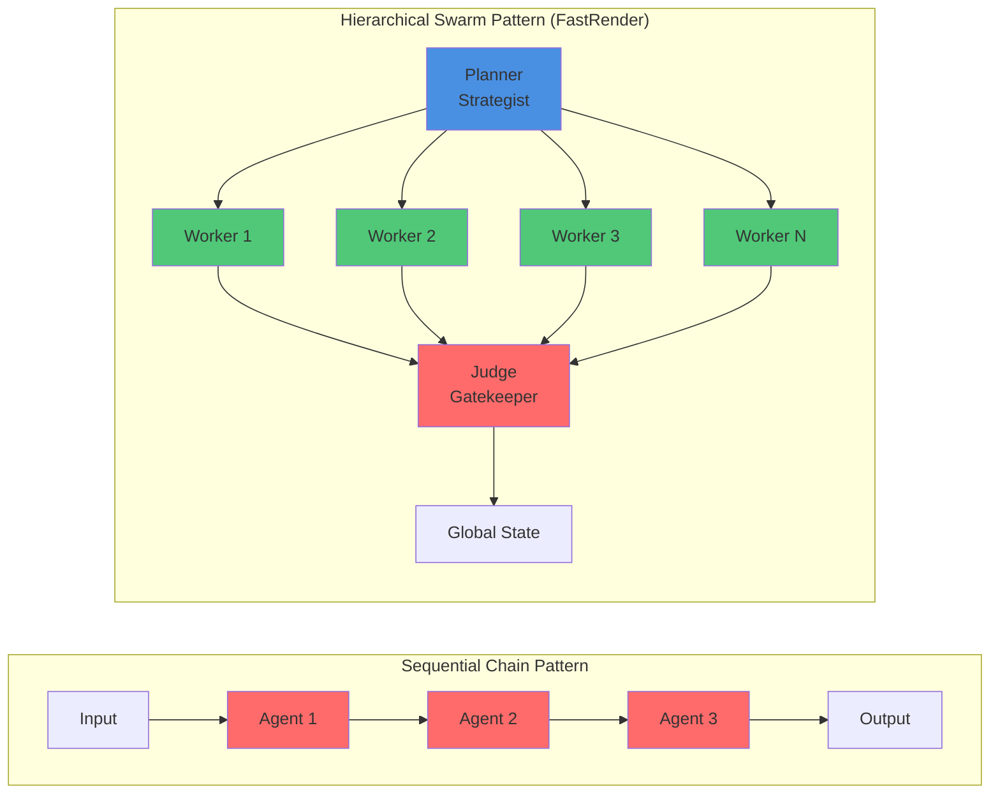

### 1.4 Architecture Diagram: FastRender Swarm

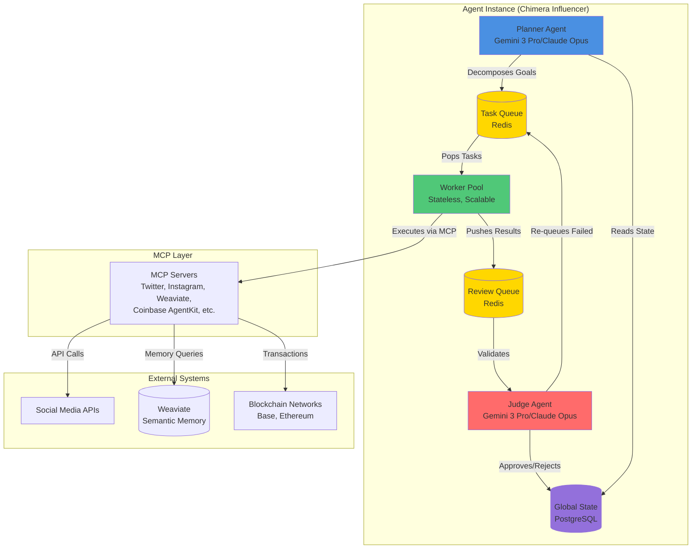

### 1.5 Task Execution Flow: Swarm Pattern

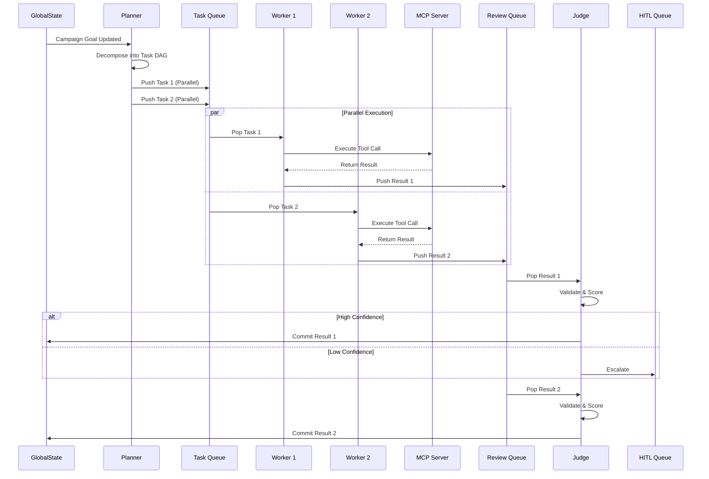

### 1.6 Implementation Details

**Planner Responsibilities:**
- Monitors GlobalState for campaign goals and trends
- Decomposes high-level objectives into executable tasks
- Creates DAG (Directed Acyclic Graph) of tasks
- Handles dynamic re-planning based on state changes
- Manages task priority and resource allocation

**Worker Responsibilities:**
- Stateless execution of single atomic tasks
- Primary consumer of MCP Tools
- No inter-Worker communication (shared-nothing)
- Returns result artifacts to ReviewQueue
- Handles retries for transient failures

**Judge Responsibilities:**
- Validates Worker outputs against acceptance criteria
- Enforces persona constraints (SOUL.md)
- Implements confidence scoring (0.0-1.0)
- Routes to HITL queue when thresholds exceeded
- Implements OCC for state consistency
- Has authority to Approve, Reject, or Escalate

---

## 2. Human-in-the-Loop (HITL) Architecture

### 2.1 HITL Design Principles

The HITL layer serves as the **safety net** for autonomous operations, balancing velocity with brand safety and regulatory compliance. It operates on a **confidence-based routing** model rather than requiring human approval for every action.

### 2.2 Confidence-Based Routing Logic

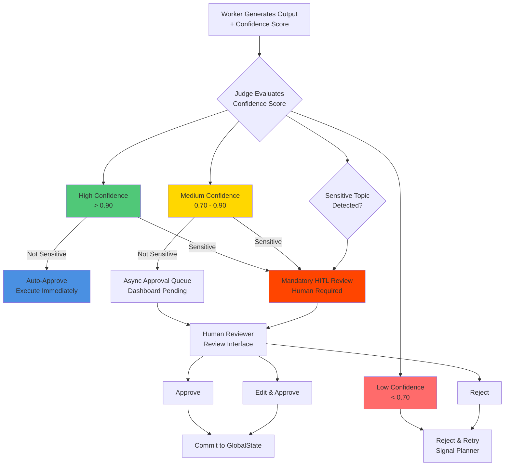

### 2.3 HITL Safety Layer Architecture

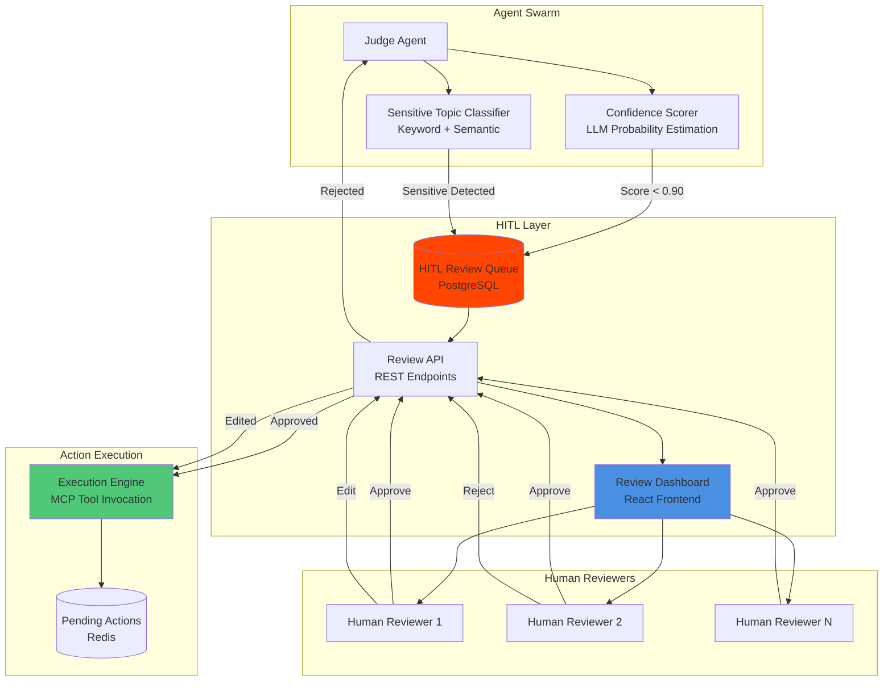

### 2.4 HITL Integration Points

**1. Judge Agent Escalation**
- Judge evaluates every Worker output
- Calculates confidence score (0.0-1.0) using LLM probability estimation
- Checks against sensitive topic filters (Politics, Health, Financial Advice, Legal Claims)
- Routes to HITL queue based on thresholds

**2. Review Queue Management**
- PostgreSQL table: `hitl_reviews`
- Fields: `task_id`, `agent_id`, `content_type`, `content_data`, `confidence_score`, `sensitive_flags`, `status`, `created_at`, `reviewed_at`, `reviewer_id`
- Priority ordering: Sensitive topics first, then by confidence (lowest first)

**3. Review Interface (Dashboard)**
- Real-time WebSocket updates for new items
- Batch approval capabilities for high-confidence items
- Inline editing for text content
- Media preview for images/videos
- Audit trail logging

**4. Async Approval Flow**
- Medium-confidence items (0.70-0.90) enter async queue
- Agent continues processing other tasks
- Human reviewer approves when available
- Timeout mechanism: Auto-approve after 24 hours if no action (configurable)

**5. Mandatory HITL Triggers**
- Confidence < 0.70: Automatic rejection, no HITL (Judge retries)
- Sensitive topics detected: Mandatory HITL, blocks execution
- Financial transactions > threshold: CFO Judge + HITL
- First-time content type: Conservative routing to HITL

### 2.5 HITL Workflow Sequence Diagram

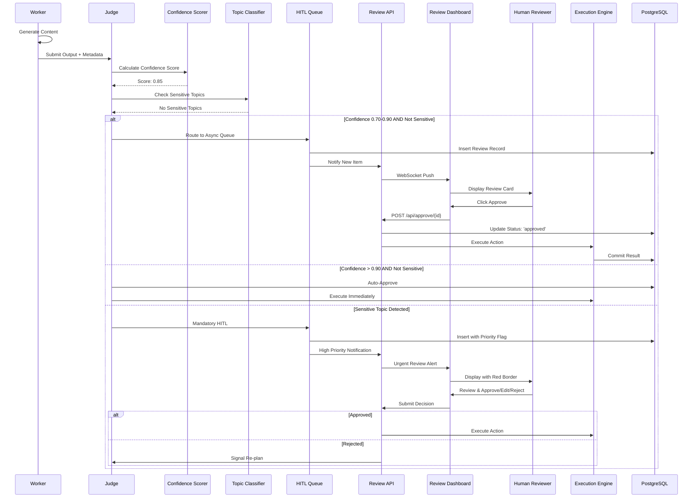

### 2.6 HITL Data Model

```sql
CREATE TABLE hitl_reviews (
    id UUID PRIMARY KEY DEFAULT gen_random_uuid(),
    task_id UUID NOT NULL REFERENCES tasks(id),
    agent_id UUID NOT NULL REFERENCES agents(id),
    content_type VARCHAR(50) NOT NULL, -- 'text', 'image', 'video', 'transaction'
    content_data JSONB NOT NULL,
    confidence_score FLOAT NOT NULL CHECK (confidence_score >= 0.0 AND confidence_score <= 1.0),
    sensitive_flags TEXT[] DEFAULT '{}',
    reasoning_trace TEXT,
    status VARCHAR(20) DEFAULT 'pending' CHECK (status IN ('pending', 'approved', 'rejected', 'edited')),
    priority INTEGER DEFAULT 0, -- Higher = more urgent
    created_at TIMESTAMP WITH TIME ZONE DEFAULT NOW(),
    reviewed_at TIMESTAMP WITH TIME ZONE,
    reviewer_id UUID REFERENCES users(id),
    review_notes TEXT,
    edited_content JSONB, -- For edited approvals
    INDEX idx_status_priority (status, priority DESC, created_at ASC),
    INDEX idx_agent_status (agent_id, status)
);
```

---

## 3. Database Strategy: SQL vs NoSQL for Video Metadata

### 3.1 Requirements Analysis

**Video Metadata Characteristics:**
- **High Velocity**: Thousands of video generation requests per day per agent
- **Structured Data**: Video metadata is inherently relational (agent_id, campaign_id, generation_params, status, etc.)
- **Query Patterns**: Complex joins (agent → campaign → videos), filtering by date range, status, platform
- **Consistency Requirements**: Financial transactions, approval workflows require ACID guarantees
- **Search Requirements**: Semantic search for similar videos (handled by Weaviate vector DB)
- **Analytics**: Aggregation queries (videos per day, cost per video, engagement metrics)

**High-Velocity Considerations:**
- Write throughput: 10,000+ inserts per minute during peak
- Read patterns: Dashboard queries, analytics, HITL review lookups
- Consistency: Must prevent duplicate publications, ensure approval state consistency

### 3.2 Database Comparison

#### PostgreSQL (SQL) - Recommended

**Advantages:**
- **ACID Compliance**: Critical for approval workflows and financial transactions
- **Relational Integrity**: Foreign keys ensure data consistency (agent_id, campaign_id references)
- **Complex Queries**: JOIN operations for analytics and reporting
- **Mature Ecosystem**: Proven tooling, monitoring, backup solutions
- **JSONB Support**: Can store flexible metadata while maintaining structure
- **Full-Text Search**: PostgreSQL FTS for keyword search (complementing Weaviate semantic search)
- **Transaction Support**: Required for OCC state updates in Judge

**Challenges:**
- Write scaling requires read replicas and connection pooling
- Partitioning needed for very large tables (time-based partitioning)

**Mitigation Strategies:**
- **Time-based Partitioning**: Partition `video_metadata` table by month
- **Read Replicas**: Separate read/write workloads
- **Connection Pooling**: PgBouncer for connection management
- **Batch Inserts**: Bulk insert operations for high-throughput writes
- **Indexing Strategy**: Composite indexes on (agent_id, created_at), (status, priority)

#### MongoDB (NoSQL) - Alternative Considered

**Advantages:**
- Horizontal scaling via sharding
- Flexible schema for evolving metadata structures
- High write throughput

**Disadvantages:**
- **No ACID Transactions**: Problematic for approval workflows
- **No Foreign Keys**: Data integrity must be enforced in application layer
- **Complex Joins**: Requires application-level joins or denormalization
- **Consistency Trade-offs**: Eventual consistency risks for financial data

**Verdict**: Not suitable for Chimera's requirements due to ACID needs and relational query patterns.

#### Cassandra (NoSQL) - Not Suitable

**Advantages:**
- Extreme write scalability
- Distributed architecture

**Disadvantages:**
- **No Joins**: Requires denormalization
- **Eventual Consistency**: Not acceptable for approval state
- **Complex Query Patterns**: Limited query flexibility

**Verdict**: Overkill for requirements, sacrifices too much consistency.

### 3.3 Decision: Hybrid Approach (PostgreSQL + Weaviate + Redis)

**Primary Database: PostgreSQL**
- Stores all transactional data: video metadata, agent configs, campaigns, HITL reviews, financial logs
- Ensures ACID guarantees for critical workflows
- Supports complex relational queries

**Vector Database: Weaviate**
- Stores semantic embeddings of video content for similarity search
- Enables "find similar videos" functionality
- Complements PostgreSQL's structured storage

**Cache Layer: Redis**
- Episodic memory (last 1 hour of interactions)
- Task queues (TaskQueue, ReviewQueue)
- Rate limiting counters
- Session state

### 3.4 Video Metadata Schema Design

```sql
-- Partitioned table for video metadata (monthly partitions)
CREATE TABLE video_metadata (
    id UUID PRIMARY KEY DEFAULT gen_random_uuid(),
    agent_id UUID NOT NULL REFERENCES agents(id),
    campaign_id UUID REFERENCES campaigns(id),
    
    -- Generation metadata
    generation_type VARCHAR(20) NOT NULL CHECK (generation_type IN ('text_to_video', 'image_to_video', 'hybrid')),
    tier VARCHAR(10) NOT NULL CHECK (tier IN ('tier1', 'tier2')), -- Cost tier
    model_provider VARCHAR(50), -- 'runway', 'luma', 'ideogram'
    model_version VARCHAR(20),
    
    -- Content metadata
    prompt_text TEXT NOT NULL,
    negative_prompt TEXT,
    style_reference_id UUID, -- Character consistency LoRA
    duration_seconds INTEGER,
    resolution_width INTEGER,
    resolution_height INTEGER,
    fps INTEGER,
    
    -- Storage & URLs
    source_video_url TEXT, -- For image_to_video
    generated_video_url TEXT,
    thumbnail_url TEXT,
    storage_bucket VARCHAR(100),
    storage_key TEXT,
    
    -- Status & Workflow
    status VARCHAR(20) NOT NULL DEFAULT 'pending' CHECK (status IN ('pending', 'generating', 'completed', 'failed', 'approved', 'published')),
    hitl_review_id UUID REFERENCES hitl_reviews(id),
    approval_status VARCHAR(20), -- 'auto_approved', 'human_approved', 'rejected'
    
    -- Cost tracking
    generation_cost_usd DECIMAL(10, 4),
    api_credits_used INTEGER,
    
    -- Timestamps
    created_at TIMESTAMP WITH TIME ZONE DEFAULT NOW(),
    generated_at TIMESTAMP WITH TIME ZONE,
    published_at TIMESTAMP WITH TIME ZONE,
    
    -- Indexes
    INDEX idx_agent_created (agent_id, created_at DESC),
    INDEX idx_campaign_status (campaign_id, status),
    INDEX idx_status_priority (status, created_at ASC),
    INDEX idx_generation_type (generation_type, tier)
) PARTITION BY RANGE (created_at);

-- Create monthly partitions (example for 2026)
CREATE TABLE video_metadata_2026_02 PARTITION OF video_metadata
    FOR VALUES FROM ('2026-02-01') TO ('2026-03-01');
CREATE TABLE video_metadata_2026_03 PARTITION OF video_metadata
    FOR VALUES FROM ('2026-03-01') TO ('2026-04-01');
-- ... continue for future months

-- JSONB column for flexible metadata (MCP tool responses, etc.)
ALTER TABLE video_metadata ADD COLUMN metadata JSONB DEFAULT '{}';
CREATE INDEX idx_metadata_gin ON video_metadata USING GIN (metadata);

-- Full-text search index for prompt text
CREATE INDEX idx_prompt_fts ON video_metadata USING GIN (to_tsvector('english', prompt_text));
```

### 3.5 High-Velocity Write Optimization

**1. Batch Insert Strategy**
```python
# Example: Bulk insert video metadata records
async def bulk_insert_video_metadata(videos: List[VideoMetadata]):
    async with db.transaction():
        await db.executemany(
            """
            INSERT INTO video_metadata 
            (agent_id, campaign_id, generation_type, prompt_text, ...)
            VALUES ($1, $2, $3, $4, ...)
            """,
            [(v.agent_id, v.campaign_id, v.generation_type, v.prompt_text, ...) 
             for v in videos]
        )
```

**2. Connection Pooling**
- Use PgBouncer in transaction pooling mode
- Pool size: 100-200 connections per database instance
- Separate pools for read/write workloads

**3. Write-Ahead Logging (WAL) Optimization**
```sql
-- PostgreSQL configuration for high write throughput
ALTER SYSTEM SET wal_buffers = '16MB';
ALTER SYSTEM SET checkpoint_completion_target = 0.9;
ALTER SYSTEM SET max_wal_size = '4GB';
```

**4. Asynchronous Processing**
- Workers write to Redis queue immediately
- Background service batch-inserts to PostgreSQL
- Reduces database connection pressure

### 3.6 Database Comparison Matrix

| Feature | PostgreSQL (SQL) | MongoDB (NoSQL) | Cassandra (NoSQL) |
|--------|------------------|-----------------|-------------------|
| **ACID Transactions** | ✅ Full ACID | ⚠️ Limited (single document) | ❌ No |
| **Foreign Keys** | ✅ Enforced | ❌ Application-level | ❌ No |
| **Complex Joins** | ✅ Native SQL | ⚠️ Application-level | ❌ No |
| **Write Throughput** | ⚠️ High (with optimization) | ✅ Very High | ✅ Extreme |
| **Consistency** | ✅ Strong | ⚠️ Eventual | ⚠️ Eventual |
| **Query Flexibility** | ✅ SQL + JSONB | ✅ Flexible | ⚠️ Limited |
| **Schema Evolution** | ✅ Migrations | ✅ Schema-less | ✅ Schema-less |
| **Full-Text Search** | ✅ Native FTS | ⚠️ Requires Atlas Search | ❌ No |
| **Vector Search** | ⚠️ pgvector extension | ⚠️ Requires Atlas Vector | ❌ No |
| **Best For** | Transactional, Relational | Document Store, Flexible | Time-Series, Extreme Scale |

**Decision Rationale**: PostgreSQL is selected because:
- ACID guarantees are **non-negotiable** for approval workflows and financial transactions
- Relational queries (agent → campaign → videos) are core to the system
- JSONB provides flexibility for evolving metadata while maintaining structure
- Mature ecosystem with proven scalability patterns (partitioning, read replicas)

### 3.7 Database Architecture Diagram

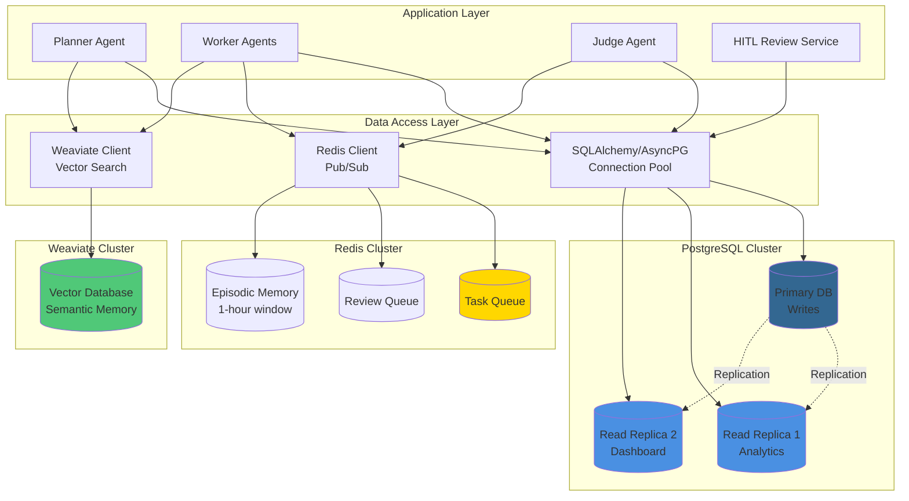

### 3.8 Video Metadata Write Flow

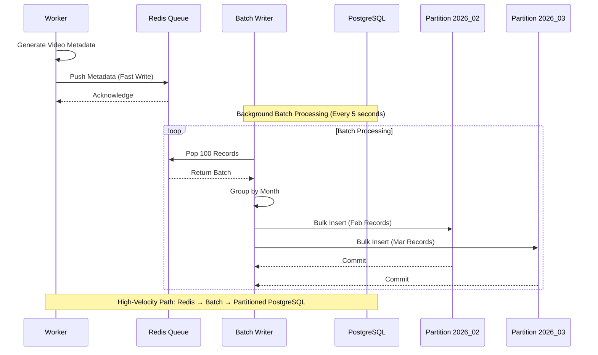

### 3.9 Database Entity Relationship Diagram

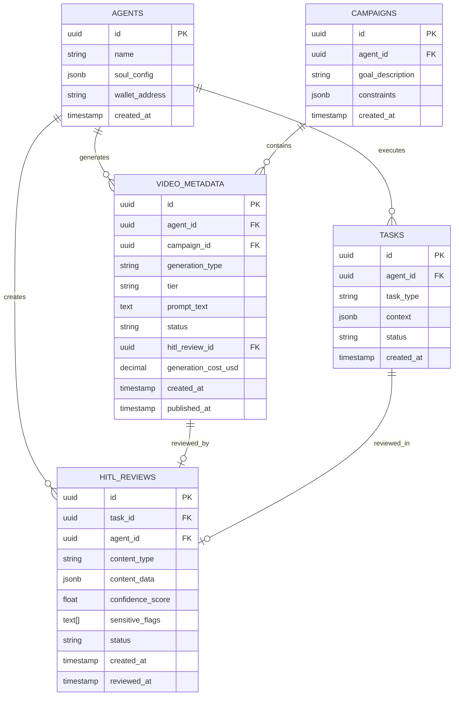

---

## 4. Architectural Decision Summary

### 4.1 Decision Matrix

| Decision Area | Selected Solution | Key Rationale |
|---------------|-------------------|---------------|
| **Agent Pattern** | Hierarchical Swarm (FastRender) | Scalability (1000+ agents), fault tolerance, quality assurance via Judge role |
| **HITL Strategy** | Confidence-Based Routing | Balances autonomy with safety; auto-approve high confidence, escalate sensitive topics |
| **Primary Database** | PostgreSQL (SQL) | ACID guarantees for transactions, relational queries, JSONB flexibility |
| **Vector Database** | Weaviate | Semantic memory, RAG pipeline, similarity search |
| **Cache/Queue** | Redis | High-throughput queues, episodic memory, pub/sub |
| **Concurrency Control** | Optimistic Concurrency Control (OCC) | High throughput without locking bottlenecks |

### 4.2 Trade-offs Analysis

#### Agent Pattern Trade-offs

| Aspect | Hierarchical Swarm | Sequential Chain |
|--------|-------------------|------------------|
| **Scalability** | ✅ Horizontal scaling of Workers | ❌ Linear bottleneck |
| **Fault Tolerance** | ✅ Isolated failures | ❌ Single point of failure |
| **Complexity** | ⚠️ Higher (3 roles) | ✅ Lower (linear flow) |
| **Quality Assurance** | ✅ Built-in Judge layer | ❌ No validation layer |
| **Cost Efficiency** | ✅ Tiered LLM usage | ⚠️ Same model for all steps |
| **Dynamic Adaptation** | ✅ Re-planning capability | ❌ Fixed workflow |

#### Database Trade-offs

| Aspect | PostgreSQL | MongoDB | Cassandra |
|--------|-----------|---------|-----------|
| **Consistency** | ✅ Strong ACID | ⚠️ Eventual | ⚠️ Eventual |
| **Query Power** | ✅ SQL + JSONB | ⚠️ Limited joins | ❌ No joins |
| **Write Throughput** | ⚠️ High (with optimization) | ✅ Very High | ✅ Extreme |
| **Operational Complexity** | ✅ Mature tooling | ⚠️ Moderate | ❌ High |
| **Cost** | ✅ Open source | ⚠️ Atlas pricing | ⚠️ Operational overhead |

### 4.3 Integration Points

The three architectural decisions integrate as follows:

1. **Swarm Pattern → HITL**: Judge agent routes to HITL queue based on confidence scoring
2. **HITL → Database**: All review decisions stored in PostgreSQL with ACID guarantees
3. **Database → Swarm**: Planner reads GlobalState from PostgreSQL to make decisions
4. **Swarm → Database**: Workers write video metadata to partitioned PostgreSQL tables

---

## 5. System Architecture Overview

### 5.1 Complete System Architecture

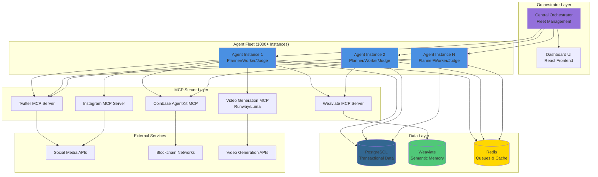

### 5.2 Data Flow: Content Generation Workflow

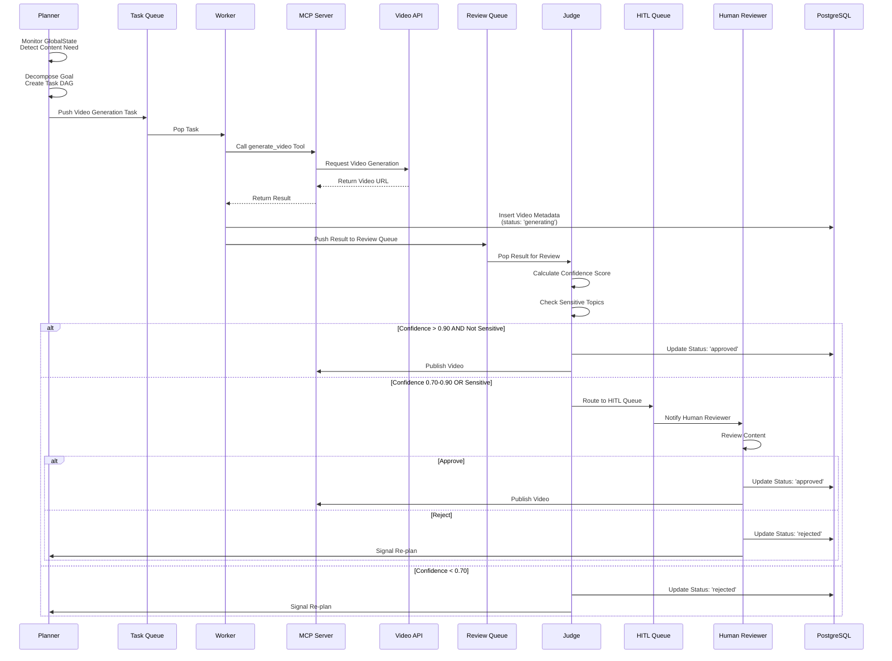

---

### 5.3 Complete System Integration Diagram

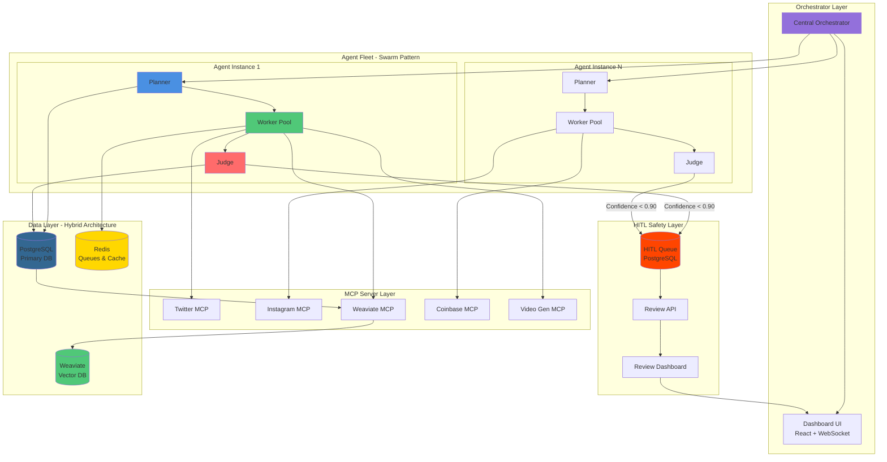

---

## 6. Implementation Roadmap

### Phase 1: Core Swarm Infrastructure (Week 1-2)
- Implement Planner-Worker-Judge services
- Set up Redis task queues
- Basic PostgreSQL schema
- MCP client integration

### Phase 2: HITL Layer (Week 3)
- HITL review queue implementation
- Review dashboard UI
- Confidence scoring logic
- Sensitive topic classification

### Phase 3: Database Optimization (Week 4)
- PostgreSQL partitioning setup
- Read replica configuration
- Connection pooling (PgBouncer)
- Batch insert optimizations

### Phase 4: Video Metadata Pipeline (Week 5-6)
- Video generation MCP server
- Metadata schema implementation
- High-velocity write path
- Analytics queries

---

## 7. Risk Mitigation

### 6.1 Scalability Risks

**Risk**: PostgreSQL write bottleneck at 10,000+ writes/minute  
**Mitigation**: 
- Batch inserts with background workers
- Time-based partitioning
- Consider PostgreSQL read replicas for analytics
- Redis as write buffer for non-critical metadata

### 6.2 Consistency Risks

**Risk**: Race conditions in Judge OCC validation  
**Mitigation**:
- State versioning in GlobalState
- Transaction isolation levels (READ COMMITTED)
- Retry logic with exponential backoff

### 6.3 HITL Bottleneck

**Risk**: Human reviewers overwhelmed during peak  
**Mitigation**:
- Auto-approval timeout (24h default)
- Priority queuing (sensitive topics first)
- Batch approval UI
- Escalation to network operators

---

## 8. Conclusion

This architectural strategy establishes Project Chimera on three foundational decisions:

1. **Hierarchical Swarm Pattern**: Enables scalability, fault tolerance, and quality assurance through role specialization
2. **Confidence-Based HITL**: Balances autonomy with safety through dynamic routing
3. **PostgreSQL Primary Database**: Ensures ACID compliance and relational integrity for critical workflows

These decisions align with the SRS requirements for a scalable, reliable, and economically autonomous influencer network capable of operating at enterprise scale.

---

## Appendix A: Technology Stack Summary

| Component | Technology | Rationale |
|-----------|-----------|-----------|
| Agent Runtime | Python 3.11+ | MCP SDK support, async/await |
| Database | PostgreSQL 15+ | ACID, relational queries, JSONB |
| Vector DB | Weaviate | Semantic search, RAG pipeline |
| Cache/Queue | Redis 7+ | High-throughput queues, episodic memory |
| Orchestration | Kubernetes | Container orchestration, auto-scaling |
| MCP Transport | Stdio/SSE | Standardized agent connectivity |
| Frontend | React + TypeScript | Dashboard, HITL review interface |
| LLM APIs | Gemini 3 Pro/Flash, Claude Opus | Reasoning vs. throughput optimization |

---

## Appendix B: Key Metrics & SLAs

| Metric | Target | Measurement |
|--------|--------|-------------|
| Agent Fleet Size | 1,000+ concurrent | Orchestrator dashboard |
| Video Generation Throughput | 10,000/day | PostgreSQL metrics |
| HITL Review Latency | < 5 min (p95) | Review queue monitoring |
| Database Write Latency | < 50ms (p95) | PostgreSQL query logs |
| System Uptime | 99.9% | Health checks |
| Cost per Video | < $0.50 (Tier 1) | Cost tracking table |

---

**Document Status**: Approved for Implementation  
**Next Review**: After Phase 1 completion
