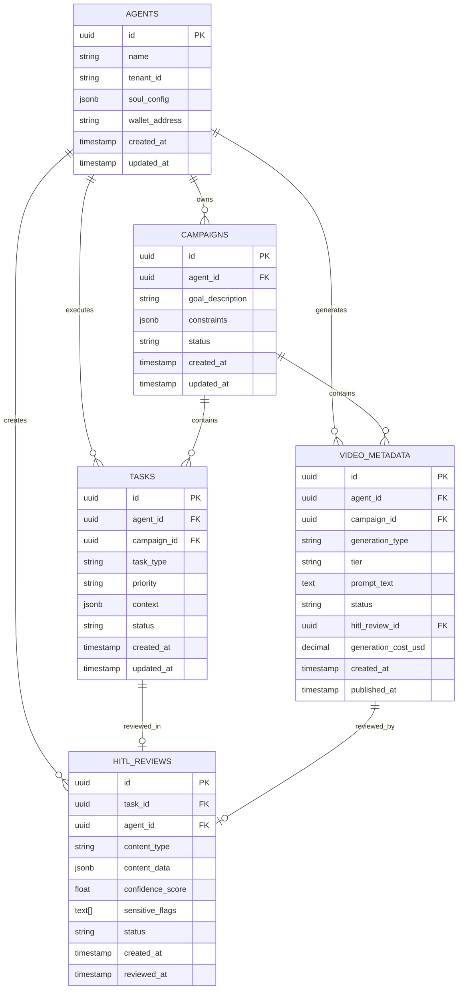

# Project Chimera: Technical Specification

**Version**: 1.0.0  
**Last Updated**: 2026-02-05  
**Status**: Active

This document defines **API contracts** (JSON inputs/outputs for agents) and the **database schema** (including ERD for video metadata and related entities). All external agent interactions use these contracts; implementation must conform.

**Meta**: `specs/_meta.md`  
**Functional**: `specs/functional.md`  
**SRS**: `docs/project-chimera-srs-challenge/project-chimera-srs.md`

---

## 1. API Contracts

All payloads are JSON. Timestamps are ISO 8601 (`YYYY-MM-DDTHH:mm:ss.sssZ`). Identifiers are UUID v4 unless stated otherwise.

---

### 1.1 Agent Task (Planner → Worker)

Payload pushed by the **Planner** to the TaskQueue (Redis). Consumed by **Workers**.

| Field | Type | Required | Description |
|-------|------|----------|-------------|
| `task_id` | string (UUID) | Yes | Unique task identifier |
| `task_type` | string (enum) | Yes | `generate_content` \| `reply_comment` \| `execute_transaction` \| `fetch_trends` |
| `priority` | string (enum) | Yes | `high` \| `medium` \| `low` |
| `context` | object | Yes | See below |
| `assigned_worker_id` | string | No | Worker instance ID (optional at creation) |
| `created_at` | string (ISO 8601) | Yes | Task creation time |
| `status` | string (enum) | Yes | `pending` \| `in_progress` \| `review` \| `complete` |

**`context` object:**

| Field | Type | Required | Description |
|-------|------|----------|-------------|
| `goal_description` | string | Yes | Human-readable goal for this task |
| `persona_constraints` | string[] | No | List of SOUL directives to respect |
| `required_resources` | string[] | No | MCP Resource URIs (e.g. `mcp://twitter/mentions/123`, `mcp://memory/recent`) |
| `campaign_id` | string (UUID) | No | Campaign this task belongs to |
| `video_tier` | string | No | For video tasks: `tier1` \| `tier2` |
| `character_reference_id` | string (UUID) | No | For image/video: style LoRA or reference asset ID |

**Example:**

```json
{
  "task_id": "550e8400-e29b-41d4-a716-446655440000",
  "task_type": "generate_content",
  "priority": "high",
  "context": {
    "goal_description": "Draft Instagram caption for summer fashion drop",
    "persona_constraints": ["Witty", "Gen-Z slang", "Never discuss politics"],
    "required_resources": ["mcp://memory/recent", "mcp://weaviate/semantic"],
    "campaign_id": "660e8400-e29b-41d4-a716-446655440001",
    "video_tier": "tier1",
    "character_reference_id": "770e8400-e29b-41d4-a716-446655440002"
  },
  "assigned_worker_id": "",
  "created_at": "2026-02-05T12:00:00.000Z",
  "status": "pending"
}
```

---

### 1.2 Worker Result (Worker → Judge)

Payload pushed by the **Worker** to the ReviewQueue (Redis). Consumed by the **Judge**.

| Field | Type | Required | Description |
|-------|------|----------|-------------|
| `result_id` | string (UUID) | Yes | Unique result identifier |
| `task_id` | string (UUID) | Yes | Source task |
| `agent_id` | string (UUID) | Yes | Chimera agent that owns this workflow |
| `status` | string (enum) | Yes | `success` \| `failure` |
| `artifact` | object | Conditional | Present when `status === "success"`; shape depends on `task_type` |
| `confidence_score` | number | Yes | Float 0.0–1.0 (NFR 1.0) |
| `error_message` | string | No | Present when `status === "failure"` |
| `created_at` | string (ISO 8601) | Yes | When the Worker produced this result |

**`artifact` (for `generate_content` / `reply_comment`):**

| Field | Type | Required | Description |
|-------|------|----------|-------------|
| `content_type` | string (enum) | Yes | `text` \| `image` \| `video` \| `multimodal` |
| `text_content` | string | No | Caption, reply body, or script |
| `media_urls` | string[] | No | URLs of generated/published media |
| `platform` | string | No | `twitter` \| `instagram` \| `threads` |
| `disclosure_level` | string | No | `automated` \| `assisted` \| `none` |

**`artifact` (for `execute_transaction`):**

| Field | Type | Required | Description |
|-------|------|----------|-------------|
| `action` | string | Yes | `native_transfer` \| `deploy_token` |
| `to_address` | string | No | Recipient address |
| `amount_usdc` | number | No | Amount in USDC |
| `token_symbol` | string | No | e.g. `USDC`, `ETH` |

**Example (success, content):**

```json
{
  "result_id": "880e8400-e29b-41d4-a716-446655440003",
  "task_id": "550e8400-e29b-41d4-a716-446655440000",
  "agent_id": "990e8400-e29b-41d4-a716-446655440004",
  "status": "success",
  "artifact": {
    "content_type": "multimodal",
    "text_content": "Summer drop is here 🔥",
    "media_urls": ["https://cdn.example.com/img/abc123.png"],
    "platform": "instagram",
    "disclosure_level": "automated"
  },
  "confidence_score": 0.92,
  "created_at": "2026-02-05T12:00:05.000Z"
}
```

---

### 1.3 MCP Tool: post_content

Publishes text and optional media to a connected social platform. Used by Workers after Judge approval.

**Input (JSON Schema):**

```json
{
  "name": "post_content",
  "description": "Publishes text and media to a connected social platform.",
  "inputSchema": {
    "type": "object",
    "properties": {
      "platform": { "type": "string", "enum": ["twitter", "instagram", "threads"] },
      "text_content": { "type": "string", "description": "Body of the post/tweet." },
      "media_urls": { "type": "array", "items": { "type": "string" } },
      "disclosure_level": { "type": "string", "enum": ["automated", "assisted", "none"] }
    },
    "required": ["platform", "text_content"]
  }
}
```

**Output:** Platform-specific payload (e.g. post ID, URL). MCP server returns `{ "success": true, "post_id": "...", "url": "..." }` or error.

---

### 1.4 MCP Tool: reply_comment

Replies to a specific mention or comment. Used in the bi-directional interaction loop.

**Input:**

| Field | Type | Required | Description |
|-------|------|----------|-------------|
| `platform` | string | Yes | `twitter` \| `instagram` \| `threads` |
| `parent_id` | string | Yes | ID of the mention/comment being replied to |
| `text_content` | string | Yes | Reply body |
| `disclosure_level` | string | No | `automated` \| `assisted` \| `none` |

**Output:** `{ "success": true, "reply_id": "..." }` or error.

---

### 1.5 MCP Tool: generate_image

Generates an image via an image-generation MCP server. **Must** include character consistency reference.

**Input:**

| Field | Type | Required | Description |
|-------|------|----------|-------------|
| `prompt` | string | Yes | Text prompt for generation |
| `character_reference_id` | string (UUID) | Yes | Style LoRA or canonical reference ID (FR 3.1) |
| `negative_prompt` | string | No | Content to avoid |
| `aspect_ratio` | string | No | e.g. `1:1`, `16:9` |

**Output:** `{ "success": true, "image_url": "https://...", "asset_id": "..." }` or error.

---

### 1.6 MCP Tool: generate_video

Generates video via Runway/Luma-style MCP server. Tier determines cost and quality path.

**Input:**

| Field | Type | Required | Description |
|-------|------|----------|-------------|
| `tier` | string | Yes | `tier1` (image-to-video / living portrait) \| `tier2` (full text-to-video) |
| `prompt_text` | string | Yes | Primary prompt |
| `source_image_url` | string | Conditional | Required for `tier1` (image-to-video) |
| `character_reference_id` | string (UUID) | No | For visual consistency |
| `duration_seconds` | number | No | Target duration |
| `negative_prompt` | string | No | Content to avoid |

**Output:** `{ "success": true, "video_url": "https://...", "job_id": "..." }` or error.

---

### 1.7 MCP Tool: get_balance

Returns wallet balance for the agent. Planner MUST call before cost-incurring workflows (FR 5.1).

**Input:** `{}` (agent identity from MCP session / wallet provider).

**Output:** `{ "success": true, "balances": { "USDC": "100.50", "ETH": "0.25" }, "wallet_address": "0x..." }` or error.

---

### 1.8 MCP Tool: send_payment (Agentic Commerce)

Requests a transfer of USDC or native asset. Must pass CFO Judge and budget checks.

**Input:**

| Field | Type | Required | Description |
|-------|------|----------|-------------|
| `to_address` | string | Yes | Recipient wallet address |
| `amount_usdc` | number | No | Amount in USDC (mutually exclusive with native amount) |
| `amount_native` | string | No | Native asset amount (e.g. ETH) |
| `token_symbol` | string | No | `USDC` \| `ETH` (default USDC) |

**Output:** `{ "success": true, "tx_hash": "0x...", "amount": "10.00" }` or error (e.g. `BudgetExceededError`).

---

### 1.9 Trend Alert (Trend Spotter Worker → Planner)

Emitted by the Trend Spotter Worker; consumed by the Planner to create content tasks.

| Field | Type | Required | Description |
|-------|------|----------|-------------|
| `alert_id` | string (UUID) | Yes | Unique alert ID |
| `agent_id` | string (UUID) | Yes | Agent(s) this trend is relevant to |
| `topics` | string[] | Yes | Cluster of related topics (e.g. `["summer fashion", "Ethiopia", "sneakers"]`) |
| `relevance_score` | number | Yes | Float 0.0–1.0 |
| `source_resources` | string[] | No | MCP Resource URIs that contributed |
| `window_start` | string (ISO 8601) | Yes | Start of analysis window |
| `window_end` | string (ISO 8601) | Yes | End of analysis window |
| `created_at` | string (ISO 8601) | Yes | Alert creation time |

---

### 1.10 HITL Review API (Dashboard ↔ Backend)

Used by the Review Dashboard to list pending items and submit decisions.

**List pending (response):**

| Field | Type | Description |
|-------|------|-------------|
| `items` | array | List of HITL review items (see below) |
| `total` | number | Total count for pagination |

**HITL item (single element of `items`):**

| Field | Type | Description |
|-------|------|-------------|
| `id` | string (UUID) | `hitl_reviews.id` |
| `task_id` | string (UUID) | Source task |
| `agent_id` | string (UUID) | Owning agent |
| `content_type` | string | `text` \| `image` \| `video` \| `transaction` |
| `content_data` | object | Full artifact (content or transaction payload) |
| `confidence_score` | number | 0.0–1.0 |
| `sensitive_flags` | string[] | e.g. `["politics", "financial_advice"]` |
| `reasoning_trace` | string | Optional Judge reasoning |
| `status` | string | `pending` \| `approved` \| `rejected` \| `edited` |
| `priority` | number | Higher = more urgent |
| `created_at` | string (ISO 8601) | When escalated |

**Submit decision (request):**

| Field | Type | Required | Description |
|-------|------|----------|-------------|
| `review_id` | string (UUID) | Yes | `hitl_reviews.id` |
| `decision` | string | Yes | `approve` \| `reject` \| `edit` |
| `edited_content` | object | Conditional | Required when `decision === "edit"` |
| `review_notes` | string | No | Human reviewer notes |

**Submit decision (response):** `{ "success": true, "review_id": "...", "executed": true }` or error.

---

## 2. Database Schema

**Database:** PostgreSQL 15+. Video metadata and high-throughput tables use **time-based partitioning** where noted. All IDs are UUID unless stated.

---

### 2.1 Entity Relationship Diagram (ERD)



---

### 2.2 Table Definitions

#### 2.2.1 `agents`

| Column | Type | Constraints | Description |
|--------|------|-------------|-------------|
| `id` | UUID | PRIMARY KEY, DEFAULT gen_random_uuid() | Agent identifier |
| `tenant_id` | VARCHAR(64) | NOT NULL, INDEX | Multi-tenant isolation |
| `name` | VARCHAR(255) | NOT NULL | Display name |
| `soul_config` | JSONB | NOT NULL | SOUL.md-derived config (voice, directives, etc.) |
| `wallet_address` | VARCHAR(42) | | On-chain wallet (Coinbase AgentKit) |
| `created_at` | TIMESTAMPTZ | NOT NULL, DEFAULT NOW() | |
| `updated_at` | TIMESTAMPTZ | NOT NULL, DEFAULT NOW() | |

---

#### 2.2.2 `campaigns`

| Column | Type | Constraints | Description |
|--------|------|-------------|-------------|
| `id` | UUID | PRIMARY KEY, DEFAULT gen_random_uuid() | Campaign identifier |
| `agent_id` | UUID | NOT NULL, REFERENCES agents(id) | Owning agent |
| `goal_description` | TEXT | NOT NULL | High-level goal (e.g. from Campaign Composer) |
| `constraints` | JSONB | DEFAULT '{}' | Optional constraints / persona rules |
| `status` | VARCHAR(20) | NOT NULL, CHECK (active, paused, completed) | |
| `created_at` | TIMESTAMPTZ | NOT NULL, DEFAULT NOW() | |
| `updated_at` | TIMESTAMPTZ | NOT NULL, DEFAULT NOW() | |

**Indexes:** `(agent_id, status)`, `(agent_id, created_at DESC)`.

---

#### 2.2.3 `tasks`

| Column | Type | Constraints | Description |
|--------|------|-------------|-------------|
| `id` | UUID | PRIMARY KEY, DEFAULT gen_random_uuid() | Task identifier (same as task_id in API) |
| `agent_id` | UUID | NOT NULL, REFERENCES agents(id) | Owning agent |
| `campaign_id` | UUID | REFERENCES campaigns(id) | Optional campaign |
| `task_type` | VARCHAR(50) | NOT NULL | generate_content, reply_comment, execute_transaction, fetch_trends |
| `priority` | VARCHAR(10) | NOT NULL | high, medium, low |
| `context` | JSONB | NOT NULL | goal_description, persona_constraints, required_resources, etc. |
| `status` | VARCHAR(20) | NOT NULL, DEFAULT 'pending' | pending, in_progress, review, complete |
| `created_at` | TIMESTAMPTZ | NOT NULL, DEFAULT NOW() | |
| `updated_at` | TIMESTAMPTZ | NOT NULL, DEFAULT NOW() | |

**Indexes:** `(agent_id, status)`, `(status, created_at ASC)`, `(campaign_id, status)`.

---

#### 2.2.4 `video_metadata`

**Partitioning:** `PARTITION BY RANGE (created_at)` (e.g. monthly partitions: `video_metadata_2026_02`, `video_metadata_2026_03`).

| Column | Type | Constraints | Description |
|--------|------|-------------|-------------|
| `id` | UUID | PRIMARY KEY, DEFAULT gen_random_uuid() | Video record identifier |
| `agent_id` | UUID | NOT NULL, REFERENCES agents(id) | Owning agent |
| `campaign_id` | UUID | REFERENCES campaigns(id) | Optional campaign |
| `generation_type` | VARCHAR(20) | NOT NULL, CHECK (text_to_video, image_to_video, hybrid) | |
| `tier` | VARCHAR(10) | NOT NULL, CHECK (tier1, tier2) | Cost tier |
| `model_provider` | VARCHAR(50) | | e.g. runway, luma, ideogram |
| `model_version` | VARCHAR(20) | | |
| `prompt_text` | TEXT | NOT NULL | Primary prompt |
| `negative_prompt` | TEXT | | |
| `style_reference_id` | UUID | | Character consistency LoRA / reference |
| `duration_seconds` | INTEGER | | |
| `resolution_width` | INTEGER | | |
| `resolution_height` | INTEGER | | |
| `fps` | INTEGER | | |
| `source_video_url` | TEXT | | For image_to_video |
| `generated_video_url` | TEXT | | Output URL |
| `thumbnail_url` | TEXT | | |
| `storage_bucket` | VARCHAR(100) | | |
| `storage_key` | TEXT | | |
| `status` | VARCHAR(20) | NOT NULL, DEFAULT 'pending' | pending, generating, completed, failed, approved, published |
| `hitl_review_id` | UUID | REFERENCES hitl_reviews(id) | If escalated to HITL |
| `approval_status` | VARCHAR(20) | | auto_approved, human_approved, rejected |
| `generation_cost_usd` | DECIMAL(10,4) | | Cost tracking |
| `api_credits_used` | INTEGER | | |
| `metadata` | JSONB | DEFAULT '{}' | Flexible MCP/tool metadata |
| `created_at` | TIMESTAMPTZ | NOT NULL, DEFAULT NOW() | Partition key |
| `generated_at` | TIMESTAMPTZ | | |
| `published_at` | TIMESTAMPTZ | | |

**Indexes:** `(agent_id, created_at DESC)`, `(campaign_id, status)`, `(status, created_at ASC)`, `(generation_type, tier)`. GIN index on `metadata` for JSONB queries. Full-text search on `prompt_text` (optional).

---

#### 2.2.5 `hitl_reviews`

| Column | Type | Constraints | Description |
|--------|------|-------------|-------------|
| `id` | UUID | PRIMARY KEY, DEFAULT gen_random_uuid() | Review record identifier |
| `task_id` | UUID | NOT NULL, REFERENCES tasks(id) | Source task |
| `agent_id` | UUID | NOT NULL, REFERENCES agents(id) | Owning agent |
| `content_type` | VARCHAR(50) | NOT NULL | text, image, video, transaction |
| `content_data` | JSONB | NOT NULL | Full artifact for human review |
| `confidence_score` | FLOAT | NOT NULL, CHECK (0.0–1.0) | Worker confidence |
| `sensitive_flags` | TEXT[] | DEFAULT '{}' | e.g. politics, financial_advice |
| `reasoning_trace` | TEXT | | Judge reasoning |
| `status` | VARCHAR(20) | NOT NULL, DEFAULT 'pending' | pending, approved, rejected, edited |
| `priority` | INTEGER | DEFAULT 0 | Higher = more urgent |
| `created_at` | TIMESTAMPTZ | NOT NULL, DEFAULT NOW() | |
| `reviewed_at` | TIMESTAMPTZ | | When human acted |
| `reviewer_id` | UUID | | References users(id) if applicable |
| `review_notes` | TEXT | | |
| `edited_content` | JSONB | | For edited approvals |

**Indexes:** `(status, priority DESC, created_at ASC)`, `(agent_id, status)`.

---

### 2.3 Video Metadata ERD (Focus)

Relationships relevant to **video metadata** storage and HITL:

- **agents** → **video_metadata**: One agent has many video records (who generated).
- **campaigns** → **video_metadata**: One campaign has many videos (optional).
- **video_metadata** → **hitl_reviews**: A video may have one HITL review when escalated (optional 1:1 after escalation).
- **tasks** → **video_metadata**: A task may produce one video record (task_id can be stored in `video_metadata.metadata` or via a separate link table if needed).

**Partitioning:** `video_metadata` is partitioned by `created_at` (e.g. monthly) to support high-velocity writes and efficient time-range queries. New partitions are created per month; historical data remains queryable via the parent table.

---

## 3. Traceability

| Section | SRS / Doc |
|---------|-----------|
| Agent Task | SRS § 6.2 Schema 1 |
| post_content | SRS § 6.2 Schema 2 |
| Worker Result, confidence_score | NFR 1.0, FR 4.1, FR 6.0 |
| generate_image, character_reference_id | FR 3.0, FR 3.1 |
| generate_video, tier | FR 3.0, FR 3.2 |
| get_balance, send_payment | FR 5.0, FR 5.1, FR 5.2 |
| Trend Alert | FR 2.2 |
| HITL routing | NFR 1.1, NFR 1.2 |
| video_metadata, hitl_reviews | Architecture strategy (research); _meta.md data layer |

Implementation MUST conform to these contracts and schemas. Changes require spec amendment and version bump.
